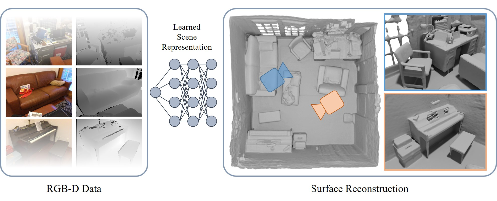

# Neural RGB-D Surface Reconstruction

### [Paper](https://dazinovic.github.io/neural-rgbd-surface-reconstruction/static/pdf/neural_rgbd_surface_reconstruction.pdf) | [Project Page](https://dazinovic.github.io/neural-rgbd-surface-reconstruction/) | [Video](https://youtu.be/iWuSowPsC3g)

> Neural RGB-D Surface Reconstruction <br />
> [Dejan Azinović](http://niessnerlab.org/members/dejan_azinovic/profile.html), [Ricardo Martin-Brualla](https://ricardomartinbrualla.com/), [Dan B Goldman](https://www.danbgoldman.com/home/), [Matthias Nießner](https://www.niessnerlab.org/members/matthias_niessner/profile.html), [Justus Thies](https://justusthies.github.io/) <br />
> CVPR 2022

<p align="center">
  
</p>

This repository contains the code for the paper Neural RGB-D Surface Reconstruction, a novel approach for 3D reconstruction that combines implicit surface representations with neural radiance fields.

## Installation

You can create a conda environment called neural_rgbd using:

```
conda env create -f environment.yaml
conda activate neural_rgbd
```

Make sure to clone the external Marching Cubes dependency and install it in the same environment:

```
cd external/NumpyMarchingCubes
python setup.py install
```

You can run an optimization using:

```
python optimize.py --config configs/<config_file>.txt
```

## Data

The data needs to be in the following format:

```
<scene_name>            # args.datadir in the config file
├── depth               # raw (real data) or ground truth (synthetic data) depth images (optional)
    ├── depth0.png     
    ├── depth1.png
    ├── depth2.png
    ...
├── depth_filtered      # filtered depth images
    ├── depth0.png     
    ├── depth1.png
    ├── depth2.png
    ...
├── depth_with_noise    # depth images with synthetic noise and artifacts (optional)
    ├── depth0.png     
    ├── depth1.png
    ├── depth2.png
    ...
├── images              # RGB images
    ├── img0.png     
    ├── img1.png
    ├── img2.png
    ...
├── focal.txt           # focal length
├── poses.txt           # ground truth poses (optional)
├── trainval_poses.txt  # camera poses used for optimization
```

The dataloader is hard-coded to load depth maps from the `depth_filtered` folder. These depth maps have been generated from the raw ones (or `depth_with_noise` in the case of synthetic data) using the same bilateral filter that was used by BundleFusion. The method also works with the raw depth maps, but the results are slightly degraded.

The file `focal.txt` contains a single floating point value representing the focal length of the camera in pixels.

The files `poses.txt` and `trainval_poses.txt` contain the camera matrices in the format 4N x 4, where is the number of cameras in the trajectory. Like the NeRF paper, we use the OpenGL convention for the camera's coordinate system. If you run this code on ScanNet data, make sure to transform the poses to the OpenGL system, since ScanNet used a different convention.

You can also write your own dataloader. You can use the existing `load_scannet.py` as template and update `load_dataset.py`.

### Dataset

The dataset used in the paper is available via the following link: <a href="http://kaldir.vc.in.tum.de/neural_rgbd/neural_rgbd_data.zip" target="_blank" rel="noopener">neural_rgbd_data.zip</a> (7.25 GB). The ICL data is not included here, but can be downloaded from the original author's [webpage](https://www.doc.ic.ac.uk/~ahanda/VaFRIC/iclnuim.html).

The scene files have been provided by various artists for free on BlendSwap. Please refer to the table below for license information and links to the .blend files.

| License       | Scene name                                             |
| ------------- | ------------------------------------------------------ |
| CC-BY         | [Breakfast room](https://blendswap.com/blend/13363)    |
| CC-0          | [Complete kitchen](https://blendswap.com/blend/11801)  |
| CC-BY         | [Green room](https://blendswap.com/blend/8381)         |
| CC-BY         | [Grey-white room](https://blendswap.com/blend/13552)   |
| CC-BY         | [Kitchen](https://blendswap.com/blend/5156)            |
| CC-0          | [Morning apartment](https://blendswap.com/blend/10350) |
| CC-BY         | [Staircase](https://blendswap.com/blend/14449)         |
| CC-BY         | [Thin geometry](https://blendswap.com/blend/8381)      |
| CC-BY         | [Whiteroom](https://blendswap.com/blend/5014)          |

## Citation

If you use this code in your research, please consider citing:

```
@inproceedings{azinovic2022neural,
    title     = {Neural RGB-D Surface Reconstruction}, 
    author    = {Dejan Azinovi{\'c} and Ricardo Martin-Brualla and Dan B Goldman and Matthias Nie{\ss}ner and Justus Thies},
    booktitle = {Proceedings of the IEEE/CVF Conference on Computer Vision and Pattern Recognition (CVPR)},
    month     = {June},
    year      = {2022}
}
```

## Further information

The code is largely based on the original NeRF code by Mildenhall et al.
https://github.com/bmild/nerf

The Marching Cubes implementation was adapted from the SPSG code by Dai et al.
https://github.com/angeladai/spsg
